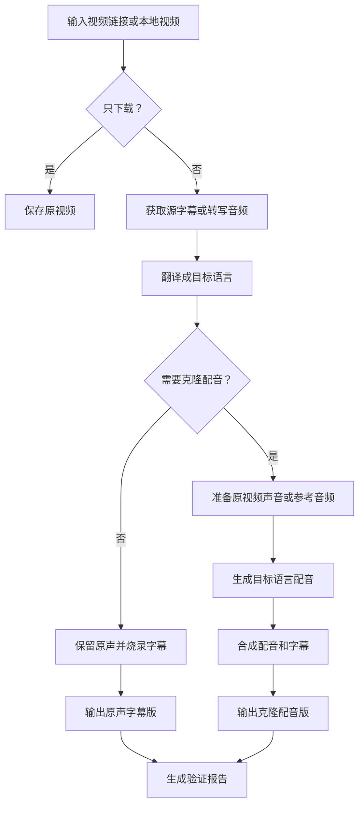

# Video Dubber

Video Dubber 是一个视频下载、字幕翻译、硬字幕生成和可选声音克隆配音的 skill。它可以处理在线视频或本地视频，输出保留原声的字幕版，也可以根据原视频或参考音频生成目标语言配音版。

[English README](README_EN.md)

## 功能

| 场景 | 结果 |
| --- | --- |
| 只下载视频 | 保存原视频 |
| 翻译字幕，保留原声 | 输出带硬字幕的视频 |
| 翻译字幕 + 克隆配音 | 输出目标语言配音视频 |
| 本地视频翻译 | 直接处理本地视频文件 |
| 指定参考音频 | 用参考声音生成配音 |

默认目标语言是中文，也可以指定日语、韩语等语言。

## 特点

| 特点 | 说明 |
| --- | --- |
| 任务可续跑 | 长视频任务中断后，可以用同一个任务目录继续，已完成的下载、字幕、翻译和配音片段会尽量复用。这里指整体任务续跑，不是单纯的下载断点续传。 |
| 节省 token | 翻译只传字幕编号和文本，不把完整时间轴反复发给模型；已翻译内容会缓存，重跑时只补缺失部分。 |
| 心跳监控 | 长时间翻译、配音或合成时，任务会记录阶段进度，方便发现卡住的阶段并继续处理。 |
| 平台字幕优先 | 有平台自带字幕时优先使用，减少转写时间和错误。 |
| NVIDIA Riva 优先 | 配置 `NVIDIA_API_KEY` 后，音频转字幕会优先使用 NVIDIA Riva gRPC ASR；不可用时再回退本地 Whisper。 |
| 原声/配音分离 | 可以只做原声硬字幕，也可以生成克隆配音；不需要配音时不会跑声音克隆流程。 |
| 输出可验证 | 每次生成后会写验证报告，记录视频时长、字幕数量和配音生成状态。 |

## 整体流程



## 安装

在支持 skills 的工具中安装：

```bash
npx skills add <video-dubber目录> -a codex -g
```

例如：

```bash
npx skills add ./video-dubber -a codex -g
```

安装后，Agent 会按任务需要检查并准备运行环境。

## 配置(可选)

不配置 `.env` 时，Agent 仍然可以下载视频、处理本地视频、使用已有字幕，或在没有 API key 时接手翻译。

建议为长视频配置单独的翻译模型。视频字幕通常很多，整片翻译会消耗较多 token；把字幕翻译交给便宜、速度快的模型，可以降低成本，也能避免占用主 Agent 的上下文。

如果要让脚本自动调用翻译模型或 NVIDIA Riva，在这个 skill 目录中找到 `.env.example`，复制成 `.env` 后填入需要的 key：

```bash
cp .env.example .env

# 用于字幕翻译
GEMINI_API_KEY=...

# 可选：用于 NVIDIA Riva 语音转字幕
NVIDIA_API_KEY=...
```

NVIDIA API key 可在 [NVIDIA Build Models](https://build.nvidia.com/models) 获取。

`model-config.yaml` 用来配置翻译模型的选择、模型名称和 API 地址。通常只需要填 `.env`；只有要切换翻译服务商、启用 NVIDIA 托管模型或调整 API 地址时，才需要改 `model-config.yaml`。

`NVIDIA_API_KEY` 可以同时用于 NVIDIA Riva 语音转字幕和 NVIDIA 托管的翻译模型。但翻译是否走 NVIDIA，取决于是否启用了 `model-config.yaml` 里的 NVIDIA 翻译模型配置；只填写 `NVIDIA_API_KEY` 不会自动把翻译模型切到 NVIDIA。

NVIDIA Riva 在这里用于 ASR，也就是把原视频语音转成带时间轴的源字幕。后续字幕翻译仍由配置的翻译模型完成，这样可以保留字幕时间轴并支持多种目标语言。

如果视频平台需要登录态，例如 Bilibili、Twitter/X、Instagram、部分 YouTube 视频，可以告诉 Agent 使用浏览器 cookies。

## 使用方式

安装后直接用自然语言告诉 Agent 你想要什么。

| 输入 | Agent 应该做 |
| --- | --- |
| 下载这个视频：`https://...` | 只下载视频 |
| 把这个视频翻译成中文字幕，保留原声 | 生成中文字幕硬字幕版 |
| 把这个英文视频翻译成中文，并用原说话人的声音配音 | 生成中文字幕 + 中文克隆配音版 |
| 给这个本地视频加日语字幕：`/path/to/video.mp4` | 处理本地视频并输出日语字幕版 |
| 用 `reference.wav` 这个声音，给 `video.mp4` 生成中文配音版 | 使用参考音频克隆指定声音 |
| 继续刚才中断的任务 | 使用同一个任务目录续跑，尽量复用已完成的下载、字幕、翻译和配音片段 |

## 输出文件

常见输出包括：

```text
output_original_<lang>_<mode>.mp4   # 原声 + 字幕
output_cloned_<lang>_<mode>.mp4     # 克隆配音 + 字幕
verification_report_<lang>_<mode>.json
```

`verification_report` 用来确认输出视频时长、字幕数量和配音生成状态。

## 常用说法

| 需求 | 可以这样说 |
| --- | --- |
| 只要目标语言字幕 | “只显示中文字幕” |
| 双语字幕 | “做成中英双语字幕” |
| 不要克隆声音 | “保留原声，不要配音” |
| 指定语言 | “翻译成日语/韩语/中文” |
| 使用登录态 | “用 Chrome cookies 下载” |
| 处理播放列表 | “下载第 1 到第 10 个视频” |
| 自动识别源语言 | “源语言自动识别” |
