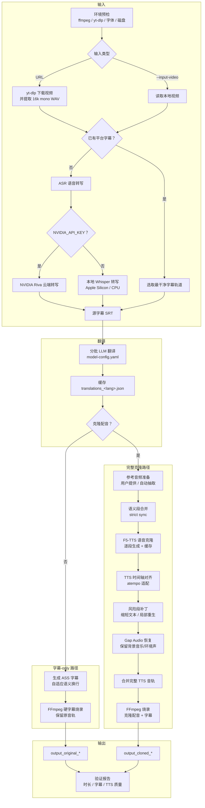

# Video Dubber

Video Dubber 是一个强大的自动化视频多语言配音与字幕翻译工具，支持将 YouTube 等平台的视频，或者本地视频，自动翻译并生成带中文字幕和高质量中文克隆配音（或日语/韩语等目标语言）的视频。

## 核心能力 (Features)

- **广泛的平台支持**：支持下载 YouTube 等站点的视频，也支持处理本地 `.mp4` 视频。
- **高质量语音转写 (ASR)**：优先支持 NVIDIA Riva 高精度云端语音识别（带词级时间戳），支持回退到本地 Whisper（支持 Apple Silicon/Mac MLX 硬件加速或 NVIDIA GPU/faster-whisper）。
- **智能语义翻译与对齐**：使用大语言模型（如 Gemini 3.5 Flash）进行上下文感知的智能翻译。独创的自适应语义换行与对齐策略，确保生成的配音（TTS）和画面字幕精准同步。
- **零样本声音克隆 (Voice Cloning)**：支持通过 F5-TTS 进行高质量的声音克隆，保留原说话人的音色。自动处理背景噪音并恢复无语音间隙的背景音 (Gap Audio Preservation)。
- **高度可定制的硬字幕**：支持原音单语字幕、原音双语字幕、配音单语字幕等多种模式。自带固定规范的高清字体渲染配置。
- **断点续传与长任务稳定**：核心环节全量缓存（下载、ASR、翻译、分段 TTS Chunk 等），支持意外中断后安全续跑。

## 安装方法 (Installation)

```bash
npx skills add /path/to/agent-playbook/video-dubber -a opencode -a claude-code -a codex -g
```

安装后 Agent 会自动处理 Python 依赖。需要前置安装的依赖：

- **FFmpeg**（必需）：`brew install ffmpeg`
- **Node.js**（用于 `npx`）：`brew install node`

## 翻译模型配置 (Translation Model)

复制 `.env.example` 为 `.env`，填入任一 API key 即可自动生效：

```bash
cp .env.example .env
# 编辑 .env 填入 GEMINI_API_KEY 或 OPENAI_API_KEY 等
```

脚本会自动检测已配置的 key，按 `model-config.yaml` 中的顺序选择对应模型。同时设置多个 key 时排在前面的优先。

如需切换或强制指定模型，使用 `--translation-model`：

```bash
python scripts/run_pipeline.py --translation-model openai ...
```

> 当前翻译请求由脚本直连配置的 API 完成。若希望使用 Agent 自身的模型（如 Claude CLI 的 Claude），需在 `.env` 中配置对应 API key。

## 工作流程


