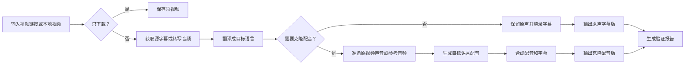

<h1 align="center">🎙️ Video Dubber —— 多语言视频配音 & 字幕翻译工具</h1>

<p align="center"><b>中文</b> | <a href="README_EN.md">English</a></p>

<p align="center">
  <a href="#"></a>
  <a href="#"></a>
  <a href="#"></a>
  <a href="#"></a>
  <a href="#"></a>
</p>

<p align="center">
  下载在线视频 · 多语言字幕翻译 · 原声/克隆配音 · 硬字幕烧录 · 任务可续跑
</p>

<br/>

支持 **YouTube / Bilibili / Twitter/X / TikTok** 等站点视频，也支持本地视频文件。默认目标语言为 **中文**，默认克隆引擎为 **Qwen3-TTS**，可指定日语、韩语等。

---

## ✨ 功能一览

| 场景 | 结果 |
| --- | --- |
| 🌐 只下载视频 | 保存原视频 |
| 📝 翻译字幕，保留原声 | 输出带**硬字幕**的视频（原声 + 目标语言字幕） |
| 🎤 翻译字幕 + 克隆配音 | 输出**目标语言配音**视频 + 硬字幕 |
| 📂 本地视频翻译 | 直接处理本地 MP4/MKV/AVI 等文件 |
| 🔊 指定参考音频 | 用**参考声音**（MP3/WAV）生成克隆配音 |
| 🔄 继续中断任务 | 复用已完成的下载、字幕、翻译和配音片段 |

---

## 🧩 特点

| 特点 | 说明 |
| --- | --- |
| 🔁 **任务可续跑** | 长视频任务中断后，同目录续跑，已完成的步骤自动跳过。 |
| 💰 **节省 Token** | 翻译只传字幕编号 + 文本，不反复发送时间轴；已缓存内容不重复翻译。 |
| ❤️ **心跳监控** | 长时间任务记录阶段进度，方便发现并处理卡住的阶段。 |
| 🏷️ **平台字幕优先** | 有平台自带字幕时优先使用，减少 ASR 转写时间和错误。 |
| 🚀 **NVIDIA Riva 优先** | 配置 `NVIDIA_API_KEY` 后 ASR 优先走 NVIDIA Riva gRPC，不可用时回退本地 Whisper。 |
| 🤖 **Qwen3-TTS 默认** | Apple Silicon 使用 MLX 版本，模型单次加载并复用 chunk；F5 保留为兼容后端。 |
| 🧪 **多模型可比** | Qwen3-TTS、F5 等输出带引擎后缀和对齐报告，不会互相覆盖。 |
| 🎬 **内容完整优先** | 超时不自动删台词、不裁句尾；安全合并同角色语义窗口，必要时局部加速并报告时间点与倍率。 |
| 🔇 **原声/配音分离** | 可只做原声硬字幕，不需要配音时不跑声音克隆流程。 |
| ✅ **输出可验证** | 每次生成后写验证报告，记录视频时长、字幕数、配音状态。 |

---

## 🔄 整体流程



---

## 🚀 安装

通过 [`npx skills`](https://github.com/vercel-labs/skills) CLI 安装到任何兼容的 Agent（OpenCode、Claude Code、Cursor 等）：

**项目级安装**（推荐，仅当前项目生效）：

```bash
npx skills add GeoLibra/video-dubber --full-depth -y
```

**全局安装**（用户级，所有项目均可使用）：

```bash
npx skills add GeoLibra/video-dubber -g --full-depth -y
```

安装后，Agent 会自动检查并准备运行环境，无需手动操作。

### 直接让 Agent 帮你安装

你也可以直接告诉 Agent（OpenCode / Claude Code / Codex 等）：

> 帮我安装 `https://github.com/GeoLibra/video-dubber` 这个 skill

Agent 会自动为你完成安装。

---

## ⚙️ 配置翻译模型

> ⚡ **核心建议**：为长视频**单独配置翻译模型**，用便宜、快速的模型做字幕翻译，既能降低成本，又能避免占用主 Agent 的上下文。

视频字幕通常很多，一部视频可能有数百至上千条字幕，整片翻译会消耗较多 token。不配置翻译模型时，Agent 也可以自行处理翻译，但会占用主 Agent 上下文。配置独立的翻译模型后，字幕翻译委托给脚本侧专门模型完成，不占用主 Agent 上下文，已缓存的内容也不会重复翻译。

Video Dubber 支持将字幕翻译独立委托给专门的翻译模型。配置后，翻译过程完全在脚本侧完成，无需主 Agent 参与。

### 翻译默认支持的模型

| 服务商 | 模型 | 需配置项 |
| --- | --- | --- |
| 🧠 **DeepSeek V4 Flash**（默认） | `deepseek-v4-flash` | `DEEPSEEK_API_KEY` |
| 🌟 **Google Gemini** | `gemini-3.5-flash` | `GEMINI_API_KEY` |
| 🤖 **OpenAI** | `gpt-4o` | `OPENAI_API_KEY` |
| 🏠 **Ollama 本地模型** | `qwen3.5:8b` | 无需 API Key |
| 🟢 **NVIDIA 托管模型** | kimi-k2.6 / deepseek-v4 等 | `NVIDIA_API_KEY` |

### 快速配置（只需两步）

<details>
<summary><b>📋 点击展开详细配置说明</b></summary>

#### 第一步：设置环境变量

在 `video-dubber` 目录中，将 `.env.example` 复制为 `.env`，填入你的 API Key：

```bash
cp .env.example .env
```

```ini
# .env — 填入任一 Key 即可自动生效
GEMINI_API_KEY=你的Gemini密钥
# OPENAI_API_KEY=你的OpenAI密钥
# DEEPSEEK_API_KEY=你的DeepSeek密钥
# NVIDIA_API_KEY=你的NVIDIA密钥
```

> 💡 **只需要填写一个**！默认使用 DeepSeek V4 Flash；没有 API Key 时，脚本会保存 `source_raw.srt`，由 Agent 取得确认后完成翻译缓存。

#### 第二步（可选）：切换翻译模型

编辑 `model-config.yaml`，取消对应服务商的注释即可切换：

```yaml
models:
  # DeepSeek V4 Flash（默认）
  - name: deepseek
    model: deepseek-v4-flash
    api_key: $DEEPSEEK_API_KEY
    api_base: https://api.deepseek.com

  # Google Gemini
  - name: gemini
    model: gemini-3.5-flash
    api_key: $GEMINI_API_KEY
    api_base: https://generativelanguage.googleapis.com/v1beta/openai/

  # OpenAI
  # - name: openai
  #   model: gpt-4o
  #   api_key: $OPENAI_API_KEY
  #   api_base: https://api.openai.com/v1

  # Ollama 本地（零成本，零 API Key）
  # - name: ollama
  #   model: qwen3.5:8b
  #   api_key: ollama
  #   api_base: http://localhost:11434/v1

  # NVIDIA 托管（统一 Key，多模型可选）
  # - name: nvidia-kimi-k2
  #   model: moonshotai/kimi-k2.6
  #   api_key: $NVIDIA_API_KEY
  #   api_base: https://integrate.api.nvidia.com/v1
```

</details>

### NVIDIA Riva ASR（可选）

除了翻译，`NVIDIA_API_KEY` 还可用于 **NVIDIA Riva** 语音转字幕（ASR）。填写后，ASR 阶段优先走 Riva gRPC，不可用时自动回退本地 Whisper。

#### 申请 NVIDIA API Key

请前往 NVIDIA 官方模型目录申请和管理 API Key：

[https://build.nvidia.com/models](https://build.nvidia.com/models)

申请后，在 `.env` 中填写：

```ini
NVIDIA_API_KEY=你的NVIDIA密钥
```

同一个 Key 可用于 NVIDIA Riva ASR，也可用于 NVIDIA 托管翻译模型；翻译模型是否启用，仍由 `model-config.yaml` 中的配置决定。

> ⚠️ `NVIDIA_API_KEY` 可以同时用于 Riva ASR 和 NVIDIA 翻译模型，但翻译是否走 NVIDIA 取决于 `model-config.yaml` 中的配置，不是只填 Key 就自动切换。

### 其他配置

| 需求 | 配置方式 |
| --- | --- |
| 🔑 视频平台登录态（Bilibili / Twitter / Instagram 等） | 告诉 Agent 使用浏览器 cookies |
| 🌐 翻译目标语言 | 直接告诉 Agent "翻译成日语/韩语/中文" |
| 📝 双语字幕 | 告诉 Agent "做成中英双语字幕" |

---

## 🎯 使用方式

安装后直接用自然语言告诉 Agent 你想要什么：

| 你说 | Agent 会做 |
| --- | --- |
| `下载这个视频：https://...` | 只下载视频 |
| `把这个视频翻译成中文字幕，保留原声` | 生成中文字幕硬字幕版 |
| `把这个英文视频翻译成中文，并用原说话人的声音配音` | 生成中文字幕 + 中文克隆配音版 |
| `给这个本地视频加日语字幕：/path/to/video.mp4` | 处理本地视频并输出日语字幕版 |
| `用 reference.wav 这个声音，给 video.mp4 生成中文配音版` | 使用参考音频克隆指定声音 |
| `继续刚才中断的任务` | 使用同一任务目录续跑，复用已完成步骤 |

---

## 📁 输出文件

```text
output_original_<语言>_<模式>.mp4   # 原声 + 硬字幕
output_cloned_<语言>_<模式>_<引擎>.mp4     # 克隆配音 + 硬字幕
verification_report_<语言>_<模式>_<引擎>.json   # 验证报告
```

---

## 💬 常用说法速查

| 需求 | 可以这样说 |
| --- | --- |
| 只要目标语言字幕 | "只显示中文字幕" |
| 双语字幕 | "做成中英双语字幕" |
| 不要克隆声音 | "保留原声，不要配音" |
| 指定语言 | "翻译成日语/韩语/中文" |
| 使用登录态 | "用 Chrome cookies 下载" |
| 处理播放列表 | "下载第 1 到第 10 个视频" |
| 自动识别源语言 | "源语言自动识别" |

### Qwen3-TTS 配音配置

默认后端是 `qwen3-tts`。模型按以下顺序解析：`--qwen3-model`、`QWEN3_TTS_MODEL`、本机已知缓存。

```bash
export QWEN3_TTS_MODEL="/path/to/qwen3/1.7b_bf16"
VIDEO_DUBBER_TTS_BACKEND=qwen3 ./skills/video-dubber/scripts/setup_env.sh
```

可显式切换：`--tts-engine qwen3-tts`（默认）、`--tts-engine f5-mlx`（F5）、`--tts-engine none`（只烧字幕）。Qwen3-TTS 支持中文、日语和韩语；日语使用 `japanese` 语言代码。输出示例：`output_cloned_ja_target_qwen3tts.mp4`。

### 时间线对齐与语速报告

默认保留完整译文，不会为了塞入原字幕时间窗自动概括内容或裁掉句尾。流程会先尝试合并能确认属于同一说话人、同一连续语义的碎字幕；无法安全合并时，使用局部 `atempo` 保持原视频时间线。

`--max-atempo` 是建议倍率和报告阈值，不是裁尾阈值。默认启用 `--allow-atempo-overflow`，实际所需倍率超过阈值时仍会完成输出，并在验证报告中列出：

- `natural`：不超过 1.15x
- `notice`：1.15x–1.30x
- `obvious`：1.30x–1.50x
- `extreme`：超过 1.50x
- 相邻片段倍率突变、对应开始/结束时间和建议试听位置

高倍率不会阻止最终文件生成，但交付时会明确提示。没有截断只代表内容完整，不代表语速自然。
