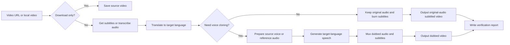

<h1 align="center">🎙️ Video Dubber — Multilingual Video Dubbing & Subtitle Translation Tool</h1>

<p align="center"><a href="README.md">中文</a> | <b>English</b></p>

<p align="center">
  <a href="#"></a>
  <a href="#"></a>
  <a href="#"></a>
  <a href="#"></a>
  <a href="#"></a>
</p>

<p align="center">
  Download Online Videos · Multilingual Subtitle Translation · Original/Cloned Dubbing · Hard-Subtitle Burn-in · Resumable Jobs
</p>

<br/>

Supports **YouTube / Bilibili / Twitter/X / TikTok** and other online video platforms, as well as local video files. The default target language is **Chinese** and the default voice-cloning backend is **Qwen3-TTS**; you can also specify Japanese, Korean, etc.

---

## ✨ Feature Overview

| Scenario | Result |
| --- | --- |
| 🌐 Download only | Save the source video |
| 📝 Translate subtitles, keep original audio | Output with **hard subtitles** (original audio + target language subs) |
| 🎤 Translate subtitles + cloned dubbing | Output **target-language dubbed** video + hard subtitles |
| 📂 Local video translation | Process local MP4/MKV/AVI files directly |
| 🔊 Reference audio | Use **reference audio** (MP3/WAV) for voice-cloned dubbing |
| 🔄 Resume interrupted tasks | Reuse completed downloads, subtitles, translation, and dubbing chunks |

---

## 🧩 Highlights

| Highlight | What it means |
| --- | --- |
| 🔁 **Resumable jobs** | Interrupted? Continue from the same directory; completed steps auto-skip. |
| 💰 **Token saving** | Translation sends only subtitle IDs + text, not the full timeline repeatedly; cached content is not re-translated. |
| ❤️ **Heartbeat monitoring** | Background jobs track PID, status heartbeat, and artifact growth so you can detect stale work and resume from the same job directory. |
| 🏷️ **Platform subtitles first** | Use platform subtitles when available to reduce ASR time and errors. |
| 🚀 **Layered ASR routing** | With `NVIDIA_API_KEY`, ASR prefers NVIDIA Riva; on Mac, local Qwen3-ASR MLX with optional ForcedAligner comes next, then mlx-whisper / Whisper. |
| 🤖 **Qwen3-TTS by default** | Apple Silicon uses the MLX version; the model loads once and is reused across chunks, while F5 remains available as a compatibility backend. |
| 🧪 **Comparable model outputs** | Qwen3-TTS and F5 outputs use engine suffixes and alignment reports, so they do not overwrite each other. |
| 🎬 **Content-first alignment** | Never auto-delete dialogue or crop sentence endings; safely merge same-speaker semantic windows, then locally accelerate and report timestamps/ratios when needed. |
| 🔇 **Original/dubbing separation** | Can produce original-audio hard-subtitled output without running voice cloning. |
| ✅ **Verifiable output** | Each run writes a verification report with duration, subtitle count, and dubbing status. |

---

## 🔄 Workflow



---

## 🚀 Installation

Install via the [`npx skills`](https://github.com/vercel-labs/skills) CLI to any compatible agent (OpenCode, Claude Code, Cursor, etc.):

**Project-level install** (recommended, current project only):

```bash
npx skills add GeoLibra/video-dubber --full-depth -y
```

**Global install** (user-level, available in all projects):

```bash
npx skills add GeoLibra/video-dubber -g --full-depth -y
```

After installation, the Agent will automatically check and prepare the runtime environment — no manual steps needed.

### Let your Agent install it

You can also simply tell your Agent (OpenCode / Claude Code / Codex etc.):

> Install the skill from `https://github.com/GeoLibra/video-dubber`

The Agent will take care of everything.

---

## ⚙️ Translation Model Configuration

> ⚡ **Key tip**: Configure a **separate translation model** for long videos. Using a cheap, fast model for subtitle translation reduces cost and avoids consuming the main Agent's context.

A video can easily have hundreds or even thousands of subtitle lines — translating the entire thing consumes a significant number of tokens. Without a dedicated translation model, the main Agent can handle translation, but it will occupy the Agent's context. With a dedicated model configured, subtitle translation runs entirely on the script side without consuming the main Agent's context, and cached segments won't be re-translated.

Video Dubber supports delegating subtitle translation to a dedicated translation model. After configuration, the translation runs entirely on the script side without the main Agent's involvement.

### Supported Providers (Default)

| Provider | Model | Config |
| --- | --- | --- |
| 🧠 **DeepSeek V4 Flash** (default) | `deepseek-v4-flash` | `DEEPSEEK_API_KEY` |
| 🌟 **Google Gemini** | `gemini-3.5-flash` | `GEMINI_API_KEY` |
| 🤖 **OpenAI** | `gpt-4o` | `OPENAI_API_KEY` |
| 🏠 **Ollama (local)** | `qwen3.5:8b` | No API Key needed |
| 🟢 **NVIDIA hosted** | kimi-k2.6 / deepseek-v4 etc. | `NVIDIA_API_KEY` |

### Quick Setup (Two Steps)

<details>
<summary><b>📋 Click to expand detailed setup</b></summary>

#### Step 1: Set environment variables

Copy `.env.example` to `.env` in the `video-dubber` directory and fill in your API Key:

```bash
cp .env.example .env
```

```ini
# .env — Fill in any one key and it works
GEMINI_API_KEY=your_gemini_key
# OPENAI_API_KEY=your_openai_key
# DEEPSEEK_API_KEY=your_deepseek_key
# NVIDIA_API_KEY=your_nvidia_key
```

> 💡 **Only one key needed!** DeepSeek V4 Flash is the default. Without an API key, the script saves `source_raw.srt` for Agent-assisted translation after confirmation.

#### Step 2 (optional): Switch translation model

Edit `model-config.yaml` and uncomment the provider you want:

```yaml
models:
  # DeepSeek V4 Flash (default)
  - name: deepseek
    model: deepseek-v4-flash
    api_key: $DEEPSEEK_API_KEY
    api_base: https://api.deepseek.com

  # Google Gemini
  - name: gemini
    model: gemini-3.5-flash
    api_key: $GEMINI_API_KEY
    api_base: https://generativelanguage.googleapis.com/v1beta/openai/

  # OpenAI
  # - name: openai
  #   model: gpt-4o
  #   api_key: $OPENAI_API_KEY
  #   api_base: https://api.openai.com/v1

  # Ollama (local, zero cost, no API key)
  # - name: ollama
  #   model: qwen3.5:8b
  #   api_key: ollama
  #   api_base: http://localhost:11434/v1

  # NVIDIA hosted (single key, multiple models)
  # - name: nvidia-kimi-k2
  #   model: moonshotai/kimi-k2.6
  #   api_key: $NVIDIA_API_KEY
  #   api_base: https://integrate.api.nvidia.com/v1
```

</details>

### NVIDIA Riva ASR (Optional)

Besides translation, `NVIDIA_API_KEY` can also be used for **NVIDIA Riva** speech-to-text (ASR). When configured, ASR first tries Riva gRPC; if the cloud service is unavailable or no key is provided, Mac Apple Silicon defaults to local Qwen3-ASR MLX, can optionally refine timestamps with Qwen3-ForcedAligner MLX, and only then falls back to mlx-whisper / Whisper.

#### Request an NVIDIA API Key

Apply for and manage the NVIDIA API Key from NVIDIA's official model catalog:

[https://build.nvidia.com/models](https://build.nvidia.com/models)

Then add it to `.env`:

```ini
NVIDIA_API_KEY=your_nvidia_key
```

The same key can be used for NVIDIA Riva ASR and NVIDIA-hosted translation models. Translation still requires enabling the desired model in `model-config.yaml`.

> ⚠️ `NVIDIA_API_KEY` can be used for both Riva ASR and NVIDIA translation models, but translation only uses NVIDIA when explicitly enabled in `model-config.yaml`.

### ASR Routing Notes

Recommended priority:

1. With `NVIDIA_API_KEY`: NVIDIA Riva cloud ASR. Key signup: [https://build.nvidia.com/models](https://build.nvidia.com/models)
2. Mac Apple Silicon, best local quality: `--asr-engine qwen3-asr-mlx --qwen3-asr-mlx-model mlx-community/Qwen3-ASR-1.7B-8bit`
3. Mac lower-memory / faster option: `mlx-community/Qwen3-ASR-0.6B-8bit`
4. Timestamp refinement: `--qwen3-aligner-mode sentence --qwen3-aligner-mlx-model mlx-community/Qwen3-ForcedAligner-0.6B-8bit`
5. Stable fallback: `mlx-whisper + mlx-community/whisper-large-v3-mlx`, and only then whisper.cpp / faster-whisper

ForcedAligner is used to re-align existing text back onto audio for finer word-level timestamps. In the default `sentence` mode, it only recalculates sentence boundaries, so the final subtitles still stay natural sentence-level rather than one word per line.

### Translation Style

The default is `--translation-style faithful`: meaning-preserving translation without deleting content to fit a time window. Compression or summarization is allowed only when you explicitly choose `--translation-style concise` or `--translation-style summary`.

### Other Configuration

| Need | How to configure |
| --- | --- |
| 🔑 Platform login (Bilibili / Twitter / Instagram etc.) | Tell the Agent to use browser cookies |
| 🌐 Translation target language | Tell the Agent "translate to Japanese/Korean/Chinese" |
| 📝 Bilingual subtitles | Tell the Agent "use Chinese-English bilingual subtitles" |

---

## Long Jobs and Heartbeat Monitoring

For long jobs, prefer the built-in detached runner. The current heartbeat design is not an auto-restarting daemon; it is a three-signal status check:

| Signal | File / tool | Purpose |
| --- | --- | --- |
| PID | `job_pid.txt` / `status_job.py` | Check whether the background process is still alive |
| Heartbeat | `pipeline_status.json` modification time | Detect whether the pipeline has stopped making stage progress |
| Artifact growth | `chunk_*_qwen3tts_*.wav`, `output_*.mp4`, `merged_tts_*.wav` | Check whether output files are still being produced |

If `status_job.py` reports `heartbeat_stale=true`, and the PID is gone or artifacts are no longer growing, resume with `resume_job.py --detached` in the same job directory. Do not delete chunks and do not switch to a new directory.

---

## 🎯 How To Use

After installing the skill, tell the Agent what you want in natural language:

| You say | Agent will do |
| --- | --- |
| `Download this video: https://...` | Download the source video only |
| `Translate this video into Chinese subtitles and keep the original audio` | Export a Chinese hard-subtitled version |
| `Translate this English video into Chinese and dub it with the original speaker's voice` | Export Chinese subtitles + Chinese voice-cloned dubbing |
| `Add Japanese subtitles to this local video: /path/to/video.mp4` | Process the local video and export a Japanese subtitled version |
| `Use reference.wav as the voice for video.mp4` | Clone the external reference voice for dubbing |
| `Continue the interrupted task` | Resume with the same job directory and reuse completed steps |

---

## 📁 Output Files

```text
output_original_<lang>_<mode>.mp4   # original audio + hard subtitles
output_cloned_<lang>_<mode>_<engine>.mp4     # cloned dubbing + hard subtitles
verification_report_<lang>_<mode>_<engine>.json   # verification report
```

The verification report records output duration, subtitle count, and dubbing status.

---

## 💬 Common Requests

| Need | Say |
| --- | --- |
| Target-language subtitles only | "Only show Chinese subtitles" |
| Bilingual subtitles | "Use Chinese-English bilingual subtitles" |
| No voice cloning | "Keep original audio, no dubbing" |
| Specific target language | "Translate to Japanese/Korean/Chinese" |
| Browser login state | "Use Chrome cookies to download" |
| Playlist range | "Download videos 1 to 10" |
| Auto-detect source language | "Auto-detect the source language" |

### Qwen3-TTS voice cloning

The default backend is `qwen3-tts`. The model is resolved from `--qwen3-model`, then `QWEN3_TTS_MODEL`, then known local cache locations.

```bash
export QWEN3_TTS_MODEL="/path/to/qwen3/1.7b_bf16"
VIDEO_DUBBER_TTS_BACKEND=qwen3 ./skills/video-dubber/scripts/setup_env.sh
```

Use `--tts-engine qwen3-tts` (default), `--tts-engine f5-mlx` (F5), or `--tts-engine none` (subtitles only). Qwen3-TTS supports Chinese, Japanese, and Korean; Japanese synthesis uses the `japanese` language code. Example: `output_cloned_ja_target_qwen3tts.mp4`.

### Timeline alignment and speed reporting

The default policy preserves the complete translation. It does not summarize dialogue or crop sentence endings merely to fit the source subtitle window. The pipeline first merges fragmented windows only when they are known to belong to the same speaker and continuous semantic sentence. When merging is unsafe, local `atempo` keeps the original video timeline.

`--max-atempo` is a preferred/reporting threshold, not a cropping threshold. `--allow-atempo-overflow` is enabled by default, so output still completes when the required ratio is higher. Verification reports include:

- `natural`: up to 1.15x
- `notice`: 1.15x–1.30x
- `obvious`: 1.30x–1.50x
- `extreme`: above 1.50x
- abrupt ratio changes, segment timestamps, and suggested review points

High ratios do not block final output, but they must be disclosed at delivery. No clipping proves content completeness, not natural pacing.

When per-segment TTS chunks already exist, `scripts/realign_existing_chunks.py` can rebuild continuous semantic windows without re-translating or loading the model. Use `--assume-single-speaker` only for confirmed single-presenter videos; it stays off for films and multi-speaker content to prevent cross-character merging.
