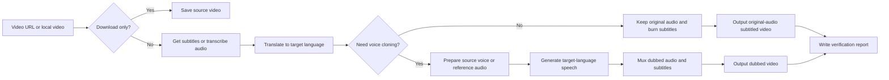

# Video Dubber

Video Dubber is a skill for video download, subtitle translation, hard-subtitle rendering, and optional voice-cloned dubbing. It works with online video links or local video files, and can produce either an original-audio subtitled video or a dubbed video in the target language.

[中文 README](README.md)

## Features

| Scenario | Result |
| --- | --- |
| Download only | Save the source video |
| Translate subtitles and keep original audio | Export a hard-subtitled video |
| Translate subtitles and clone the speaker voice | Export a dubbed video in the target language |
| Translate a local video | Process a local `.mp4` directly |
| Use a reference voice | Dub with an external reference audio |

Chinese is the default target language. You can also ask for Japanese, Korean, or another target language.

## Highlights

| Highlight | What it means |
| --- | --- |
| Resumable jobs | If a long task is interrupted, continue with the same job directory. Completed downloads, subtitles, translations, and dubbing chunks are reused where possible. This means task-level resume, not just download resume. |
| Token-conscious translation | Translation sends only subtitle IDs and text to the model instead of repeatedly sending the full timeline. Completed translations are cached, and reruns only fill missing items. |
| Heartbeat tracking | Long translation, dubbing, and synthesis stages record progress, making it easier to notice and recover from stuck stages. |
| Platform subtitles first | When platform subtitles are available, they are preferred over ASR to reduce time and transcription errors. |
| NVIDIA Riva first | If `NVIDIA_API_KEY` is configured, audio transcription uses NVIDIA Riva gRPC ASR first, then falls back to local Whisper if unavailable. |
| Separate subtitle-only and dubbing paths | You can keep original audio with hard subtitles, or generate voice-cloned dubbing. If dubbing is not requested, voice cloning is skipped. |
| Verifiable output | Each completed run writes a verification report with output duration, subtitle count, and dubbing status. |

## Workflow



## Installation

Install this directory as a skill in a tool that supports skills:

```bash
npx skills add <video-dubber-directory> -a codex -g
```

Example:

```bash
npx skills add ./video-dubber -a codex -g
```

After installation, the Agent will check and prepare the runtime environment as needed.

## Configuration(optional)

Without `.env`, the Agent can still download videos, process local videos, use existing subtitles, or handle translation itself when no API key is available.

For long videos, it is recommended to configure a separate translation model. Videos often contain many subtitle lines, and full-video subtitle translation can consume a lot of tokens. Using a cheaper, faster model for subtitle translation can reduce cost and avoid filling the main Agent context.

If you want the script to call translation models or NVIDIA Riva automatically, find `.env.example` in this skill directory, copy it to `.env`, and add the keys you need:

```bash
cp .env.example .env

# For subtitle translation
GEMINI_API_KEY=...

# Optional: for NVIDIA Riva audio transcription
NVIDIA_API_KEY=...
```

You can get an NVIDIA API key from [NVIDIA Build Models](https://build.nvidia.com/models).

`model-config.yaml` configures translation model selection, model names, and API endpoints. Most users only need to fill `.env`; edit `model-config.yaml` only when you want to switch translation providers, enable NVIDIA-hosted models, or adjust API endpoints.

`NVIDIA_API_KEY` can be used for both NVIDIA Riva transcription and NVIDIA-hosted translation models. Translation uses NVIDIA only when an NVIDIA translation model is enabled in `model-config.yaml`; setting `NVIDIA_API_KEY` alone does not automatically switch subtitle translation to NVIDIA.

NVIDIA Riva is used here for ASR, turning source speech into timestamped subtitles. Subtitle translation still uses the configured translation model so the pipeline can preserve subtitle timing and support multiple target languages.

If a platform requires login state, such as Bilibili, Twitter/X, Instagram, or some YouTube videos, tell the Agent to use browser cookies.

## How To Use

After installing the skill, tell the Agent what you want in natural language.

| Input | Agent should do |
| --- | --- |
| Download this video: `https://...` | Download the source video only |
| Translate this video into Chinese subtitles and keep the original audio | Export a Chinese hard-subtitled version |
| Translate this English video into Chinese and dub it with the original speaker's voice | Export Chinese subtitles + Chinese voice-cloned dubbing |
| Add Japanese subtitles to this local video: `/path/to/video.mp4` | Process the local video and export a Japanese subtitled version |
| Use `reference.wav` as the voice for `video.mp4` | Clone the external reference voice for dubbing |
| Continue the interrupted task | Resume with the same job directory and reuse completed downloads, subtitles, translations, and dubbing chunks where possible |

## Output Files

Common outputs:

```text
output_original_<lang>_<mode>.mp4   # original audio + subtitles
output_cloned_<lang>_<mode>.mp4     # cloned dubbing + subtitles
verification_report_<lang>_<mode>.json
```

The verification report records output duration, subtitle count, and dubbing status.

## Common Requests

| Need | Say |
| --- | --- |
| Target-language subtitles only | “Only show Chinese subtitles” |
| Bilingual subtitles | “Use Chinese-English bilingual subtitles” |
| No voice cloning | “Keep original audio, no dubbing” |
| Specific target language | “Translate to Japanese/Korean/Chinese” |
| Browser login state | “Use Chrome cookies to download” |
| Playlist range | “Download videos 1 to 10” |
| Auto-detect source language | “Auto-detect the source language” |
